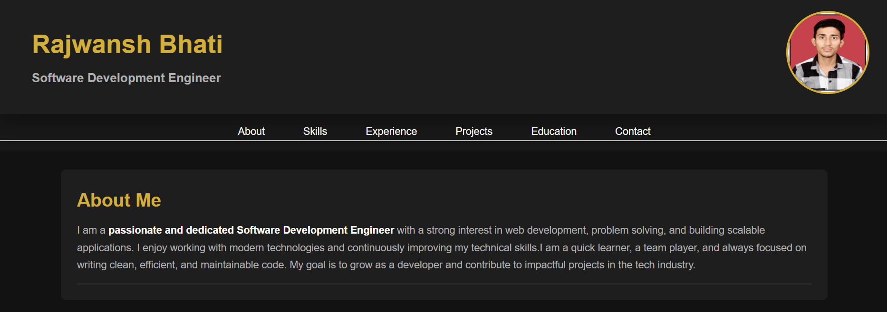
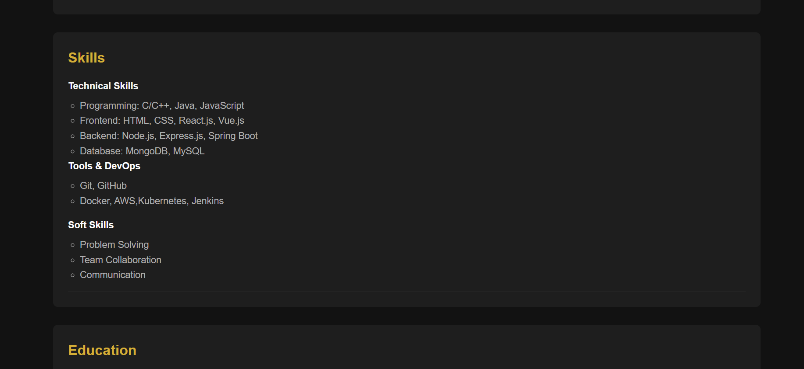
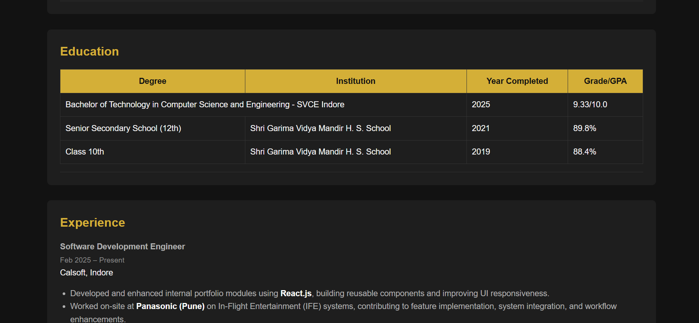
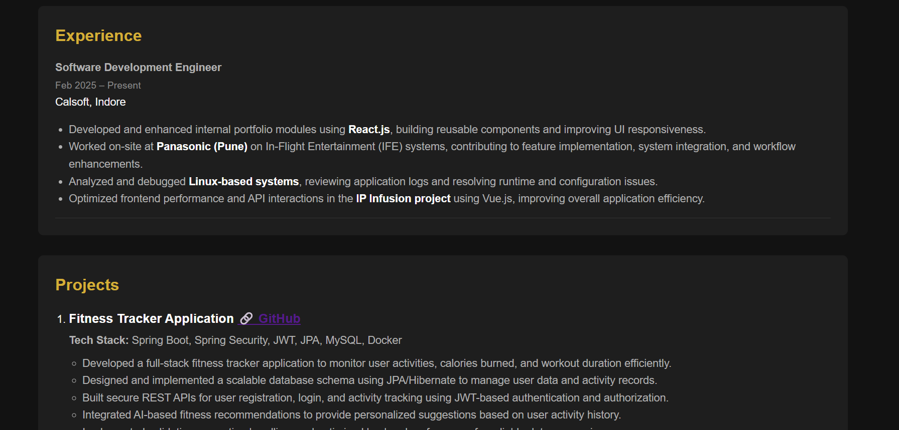
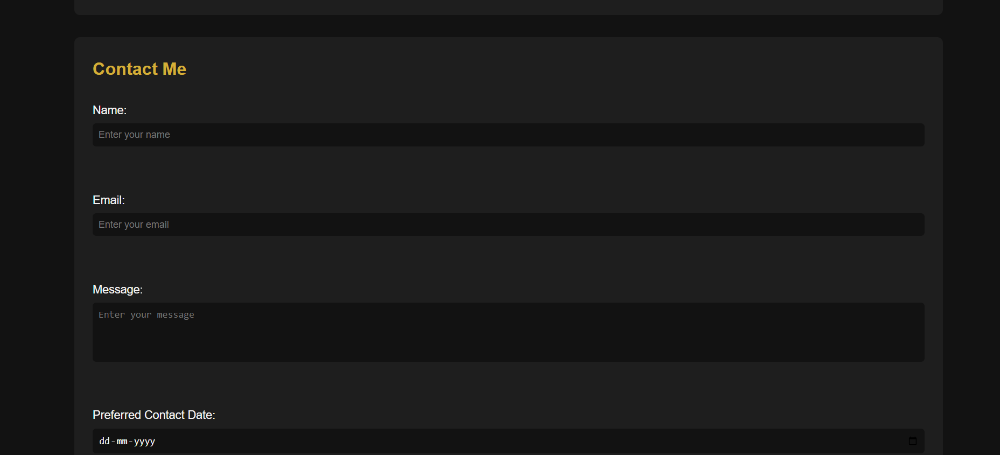
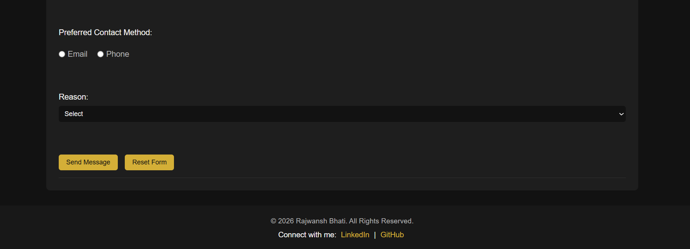

**Personal Portfolio Website**

This is a personal portfolio website built using HTML and CSS. The purpose of this project is to showcase my skills, projects, and contact information in a clean and responsive design.

The website includes multiple sections such as Home, About, Skills, Projects, and Contact. It is designed to give a quick overview of my profile and highlight the work I have done.

**Features**

* Responsive design for different screen sizes
* Clean and modern UI layout
* Navigation bar with smooth scrolling
* Organized and readable code

**Tech Stack**

* HTML
* CSS

**How to Run**

* Download or clone the repository
* Open the project folder
* Open `index.html` in your browser

**Screenshot**

