**Product Inventory Management System**

The Product Inventory Management System is a responsive web application built using HTML, CSS, and JavaScript. It allows users to perform complete CRUD operations, including adding, editing, and deleting products.

The application provides features like search, category filtering, low stock detection, and sorting to efficiently manage product data. Pagination is implemented to handle larger datasets smoothly.

An analytics dashboard displays key insights such as total products, total inventory value, and out-of-stock items in real time. Data is stored using LocalStorage to maintain persistence.

**Features**

* Add new products
* Edit existing products
* Delete products
* Search products by name
* Filter by category
* Low stock filter (stock less than 5)
* Sort products (Price: Low to High, High to Low, A-Z, Z-A)
* Pagination for better data handling
* Analytics dashboard (Total Products, Total Value, Out of Stock)
* Data persistence using LocalStorage
* Toast notifications for user actions
* Loader with spinner during data loading
* Fully responsive design

**Tech Stack**

* HTML5 – Structure of the application
* CSS3 – Styling and responsive design
* JavaScript (ES6) – Application logic and interactivity
* LocalStorage (for data persistence)

**How to Run**

* Clone the Repository

  https://github.com/RajwanshBhati/dev-practice-repo.git

* Navigate to Project Folder

  cd mini_app

* Open the project
    
  Simply open index.html in your browser Use Live Server 

**SCREENSHOT**

Dashboard Section

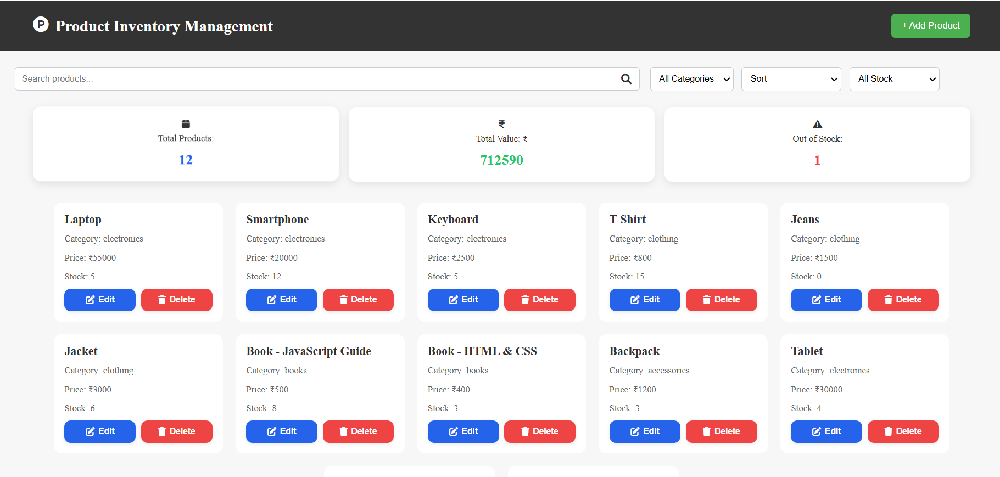

Shows overall analytics including total products, total inventory value, and out-of-stock items.

Search Functionality

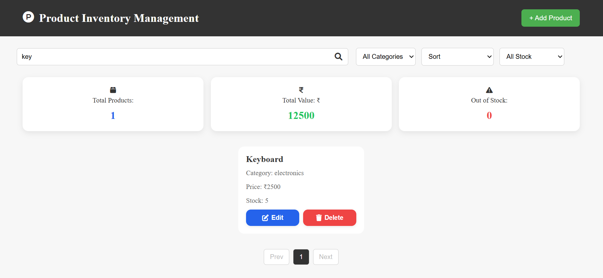

Allows users to quickly find products by typing their names in the search bar.

Category Filter

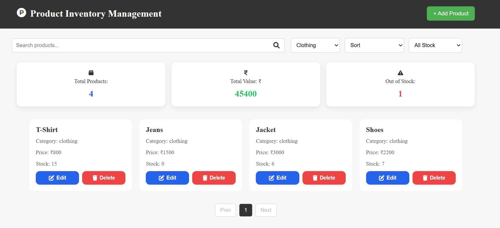

Filters products based on selected category from the dropdown menu

Category Filter + Search

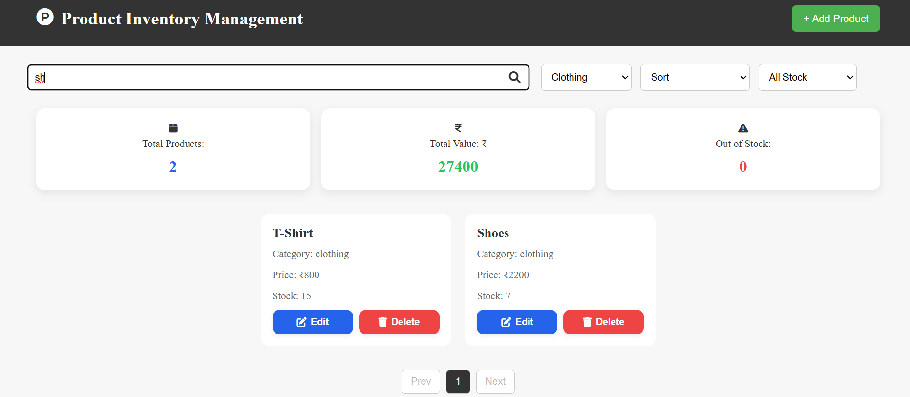

Combines category filtering with search for more precise results.

Sort Low to High Filter

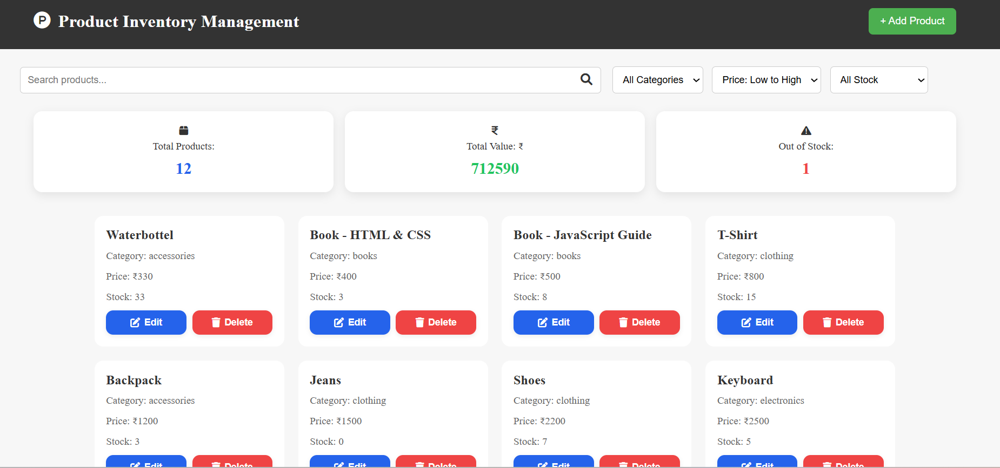

Combines category filtering with search for more precise results.

Sort High to Low

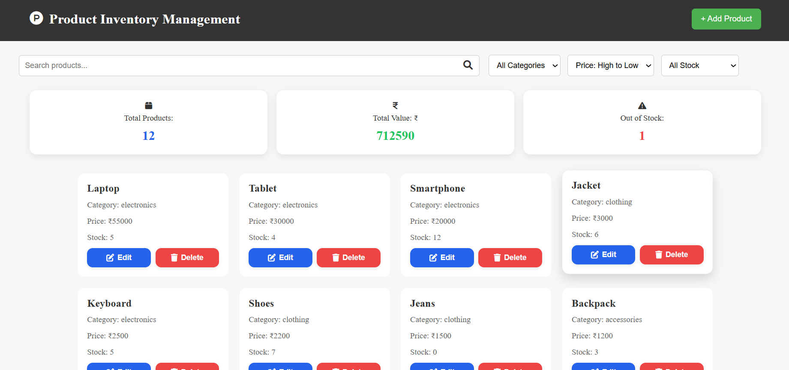

Sorts products by price in descending order (high to low).

Sort A to Z

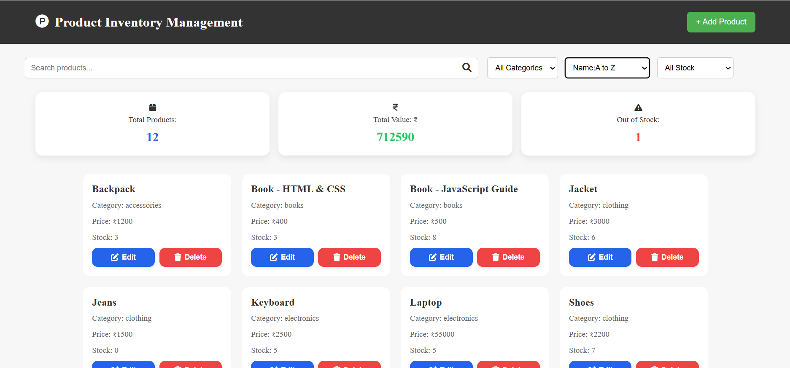

Sorts product names alphabetically from A to Z.

Sort Z to A

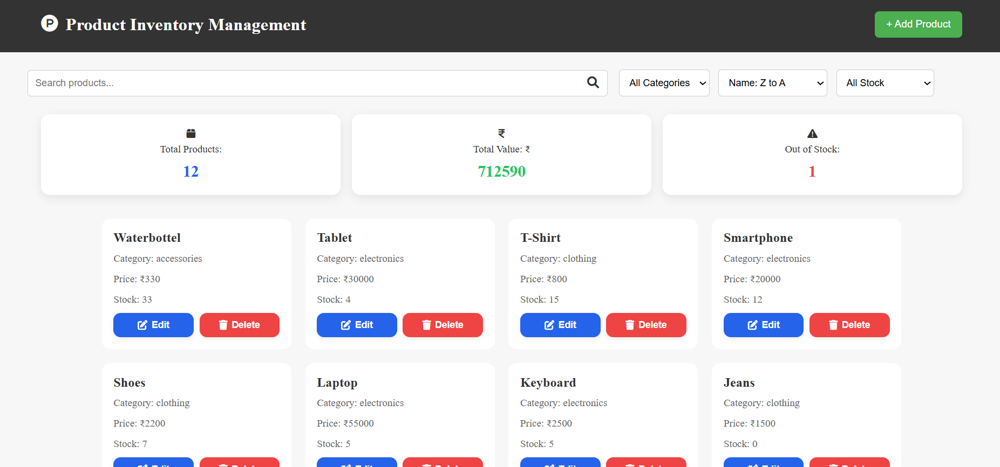

Sorts product names in reverse alphabetical order (Z to A).

Low Stock

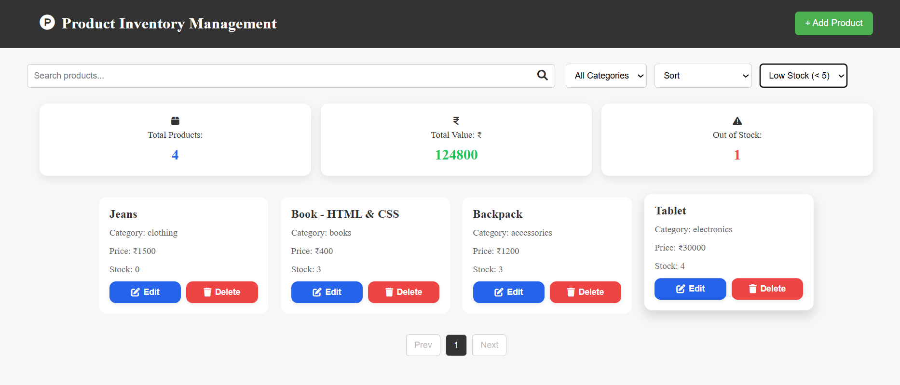

Displays only products with stock less than 5 for quick inventory checks.

Add Product Page

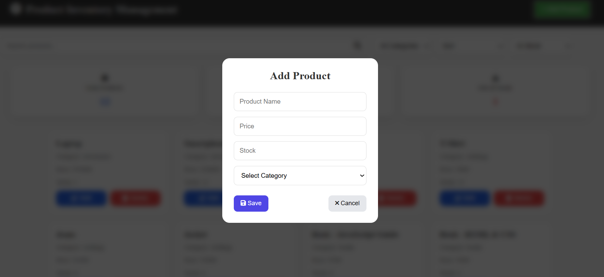

Form interface to add a new product with all required details.

Add Product Validation

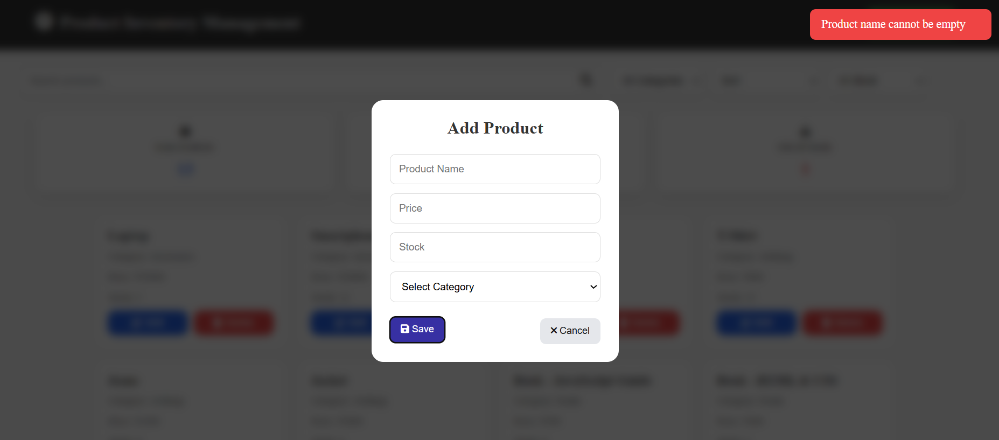

Validates user input to ensure correct product data before saving.

Add Product Toast

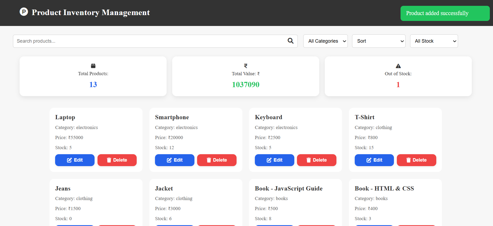

Validates user input to ensure correct product data before saving.

Delete Product Model

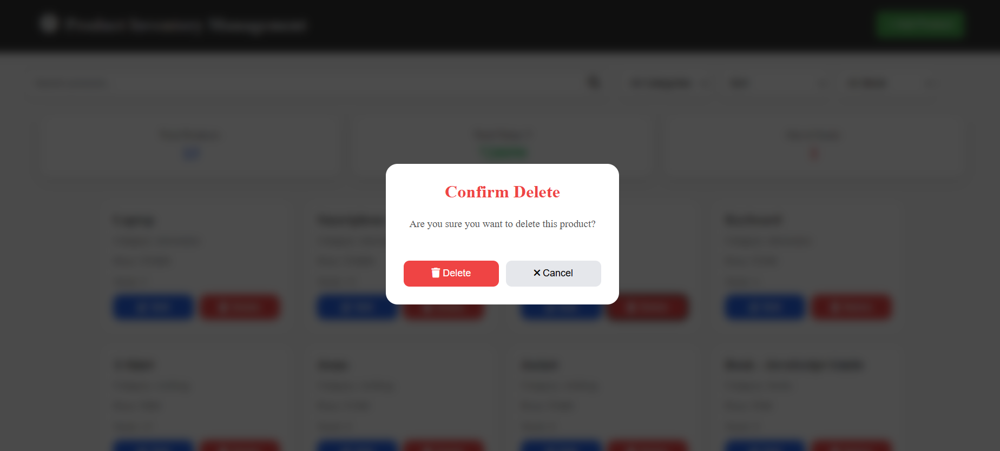

It validates before delete 

Delete Product 

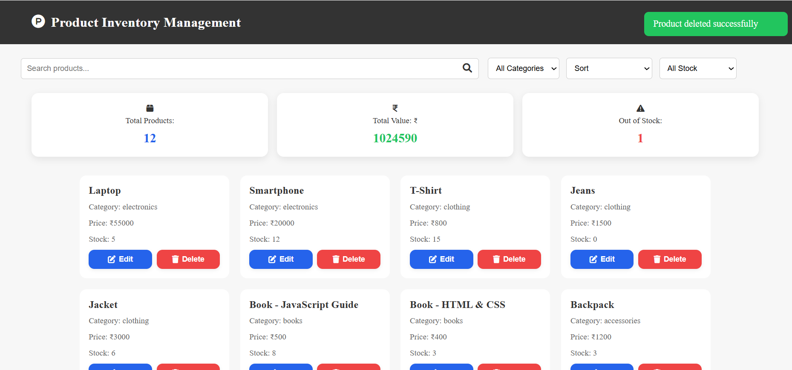

Allows users to remove a product from the inventory.

Edit Product Page

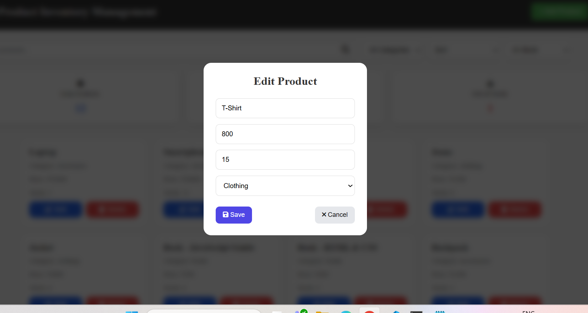

Opens a pre-filled form to update existing product details.

Edit product

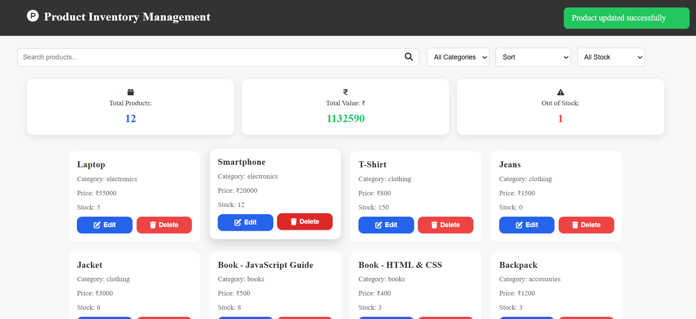

Shows successful update after editing a product.

Loading Product

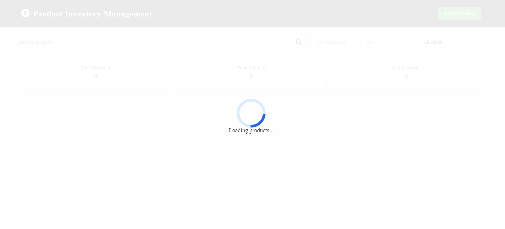

Displays a loading spinner while products are being fetched or rendered.

Pagination

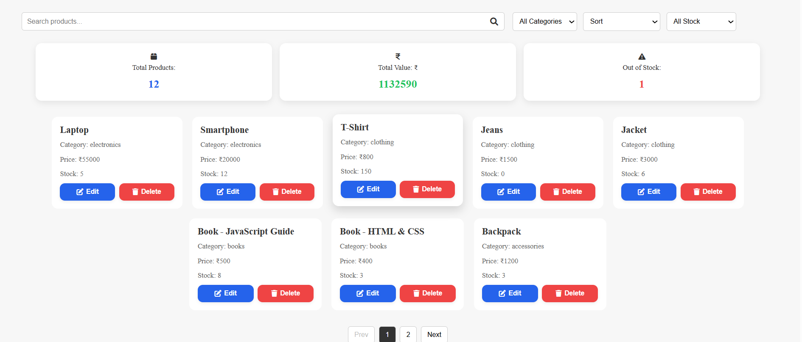

Implements pagination to display a limited number of products per page, improving performance and providing smooth navigation between pages

Local Storage Store

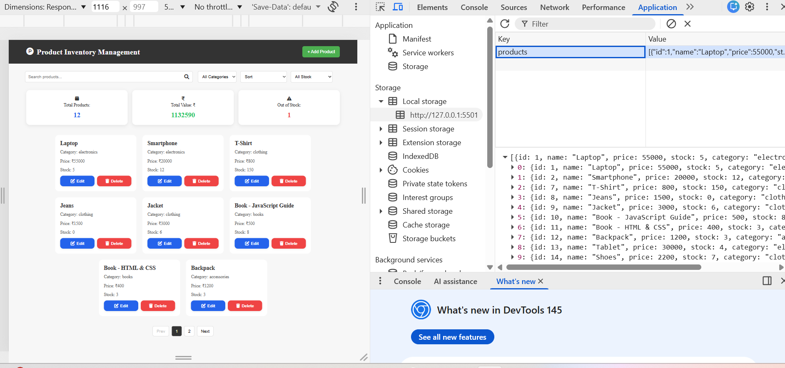

Stores product data in browser localStorage for persistence.

Responsiveness

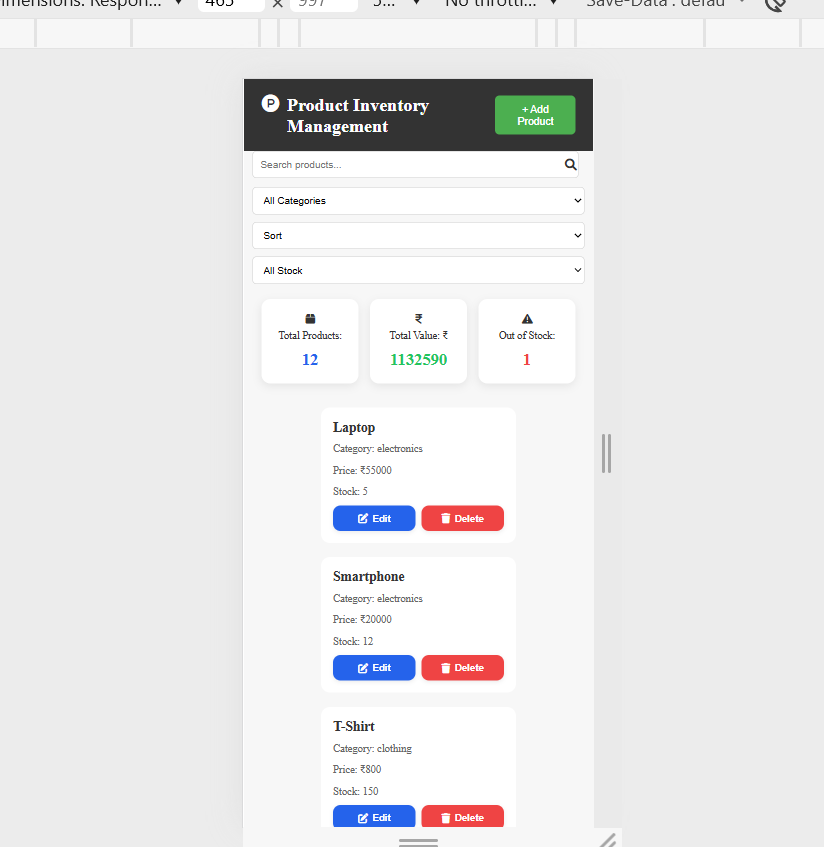

The application is fully responsive and adapts smoothly to different screen sizes including mobile, tablet, and desktop for a consistent user experience

  