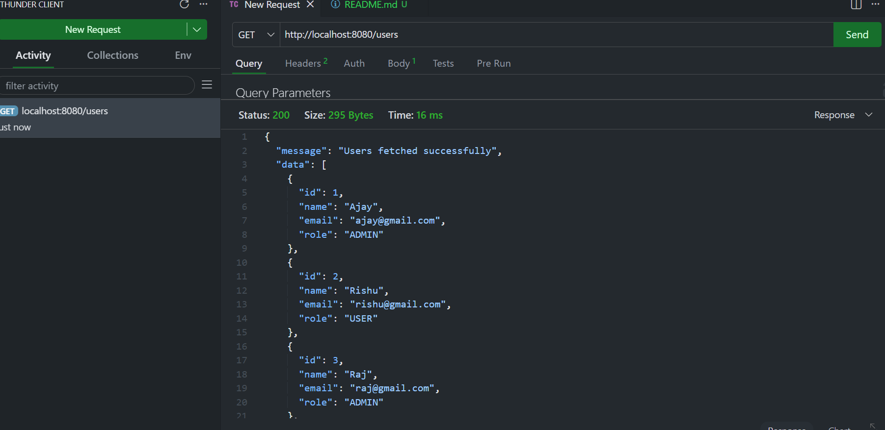
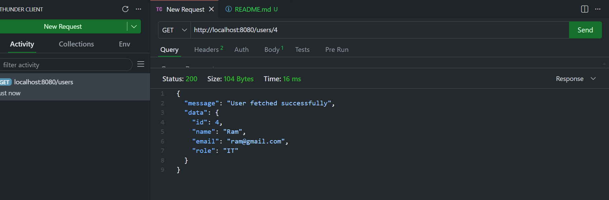
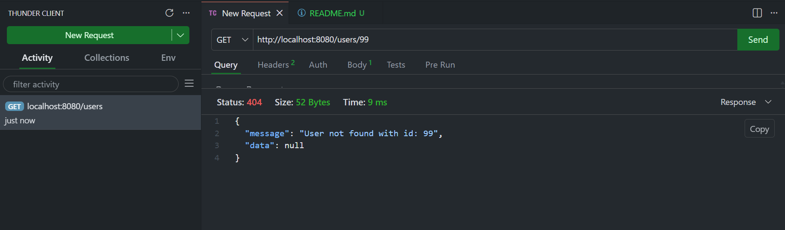
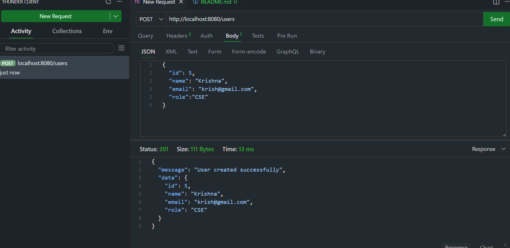
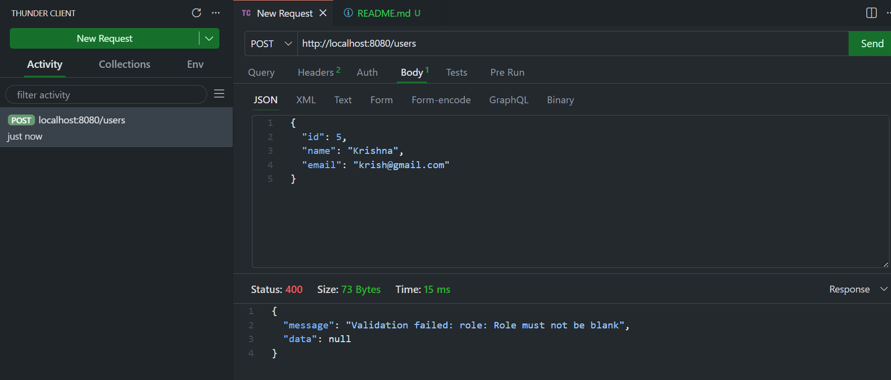
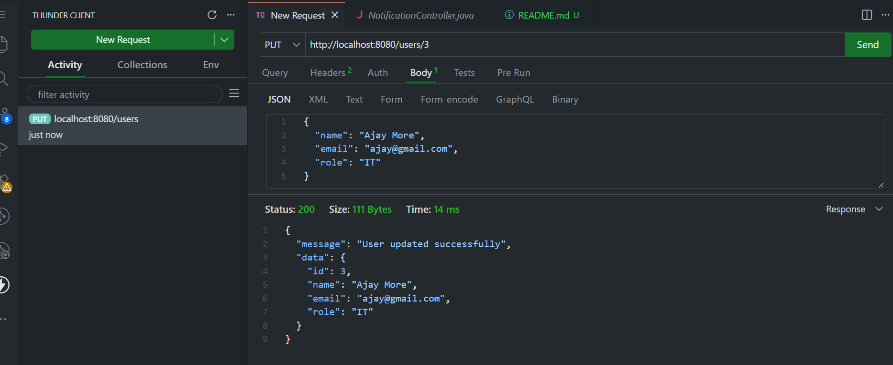
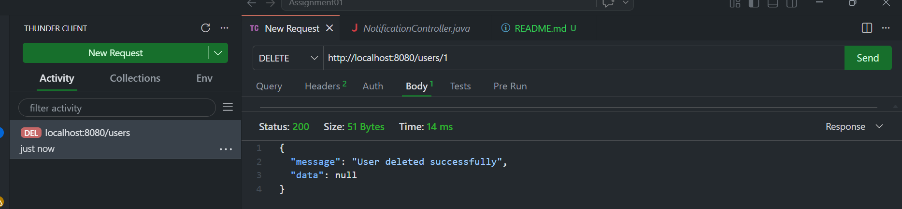
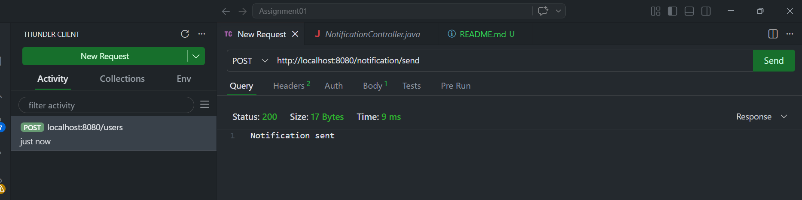
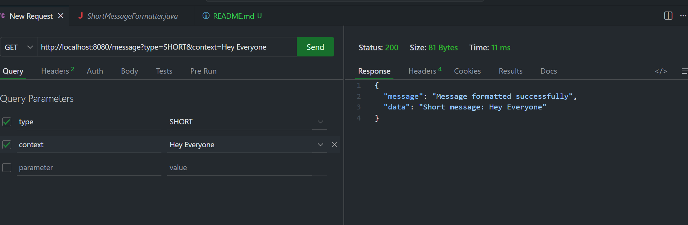
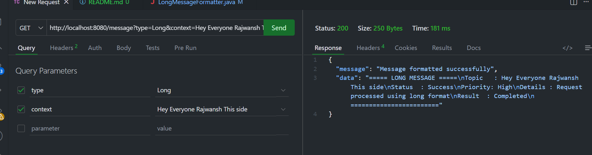

**Spring Boot Assignment — Session 2**

**Overview**

This project is part of the Java Fundamentals training assignment. It demonstrates core Spring Boot concepts, strict layered architecture, and REST API development. The application is built without a physical database, relying instead on thread-safe in-memory data structures to handle state.

## Tech Stack

- Java 17
- Spring Boot
- Maven (Build Tool)
- RESTful APIs
- In-Memory Data Storage (No Database Integration)

## Features

- Create Data
- Fetch All Records
- Fetch Record by ID
- Update Existing Data
- Delete Data
- Layered Architecture (Controller → Service → Repository)

## Project Structure

- Controller → Handles API Requests
- Service → Business Logic
- Repository → In-Memory Data Handling
- Model → Entity Classes
- DTO → Data Transfer Objects

## How to Run the Project

1. **Clone the repository**

git clone https://github.com/RajwanshBhati/dev-practice-repo.git

cd .\Rajwansh_java_training\session2\

2. **Build the project**

mvn clean install

3. **Run the application**

mvn spring-boot:run

## API Endpoints

###  User APIs
This module handles all user-related operations such as creating, retrieving, updating, and deleting users.

- **Get All Users**  
  - Endpoint: `/users`  
  - Method: GET  
  - Description: Returns a list of all users  

- **Get User by ID**  
  - Endpoint: `/users/{id}`  
  - Method: GET  
  - Description: Returns details of a specific user  

- **Add User**  
  - Endpoint: `/users`  
  - Method: POST  
  - Description: Adds a new user after validating input  

- **Update User**  
  - Endpoint: `/users/{id}`  
  - Method: PUT  
  - Description: Updates user details based on ID  

- **Delete User**  
  - Endpoint: `/users/{id}`  
  - Method: DELETE  
  - Description: Deletes a user if the ID exists  

---

###  Notification API
This module is responsible for sending notifications using a reusable component.

- **Send Notification**  
  - Endpoint: `/notification`  
  - Method: GET  
  - Description: Returns a success message indicating that the notification has been sent  

---

### Formatter API
This module is used to format messages based on the selected type.

- **Short Format**  
  - Endpoint: `/formatter?message=Hello&type=short`  
  - Method: GET  
  - Description: Returns a short formatted message  

- **Long Format**  
  - Endpoint: `/formatter?message=Hello&type=long`  
  - Method: GET  
  - Description: Returns a detailed formatted message  

## API Testing (Thunder Client)

**Get All Users**

**GET User by ID (Valid)**

**GET User by ID (Invalid)**

**Add User**

**POST Create User (Invalid Data)**

**Update User**

**Delete User**

**Notification API**

**Short Message**

**Long Message**

**Author**

Rajwansh Bhati

