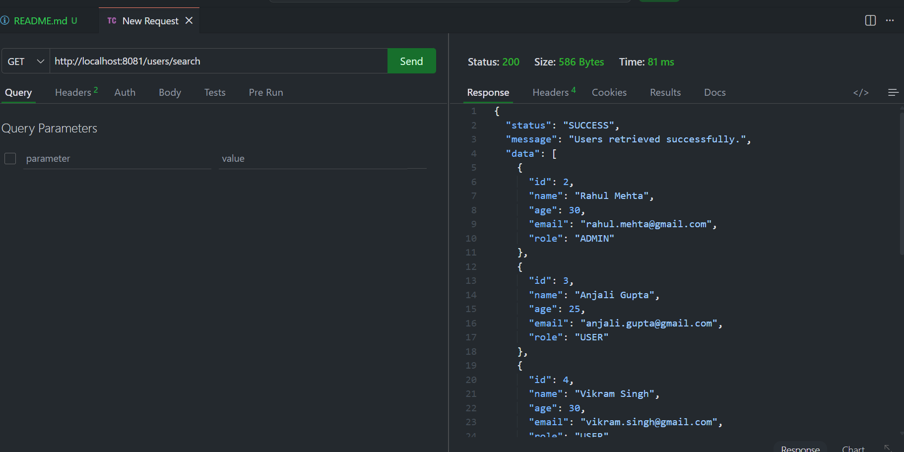
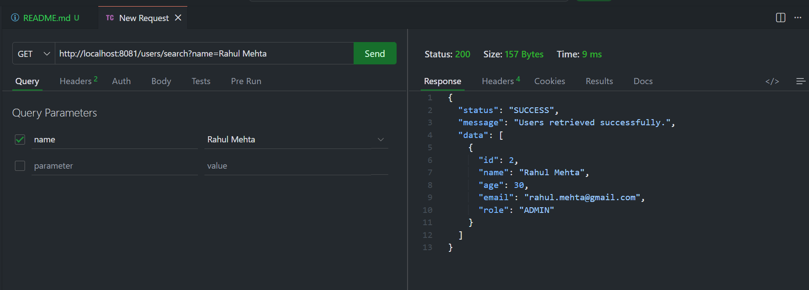
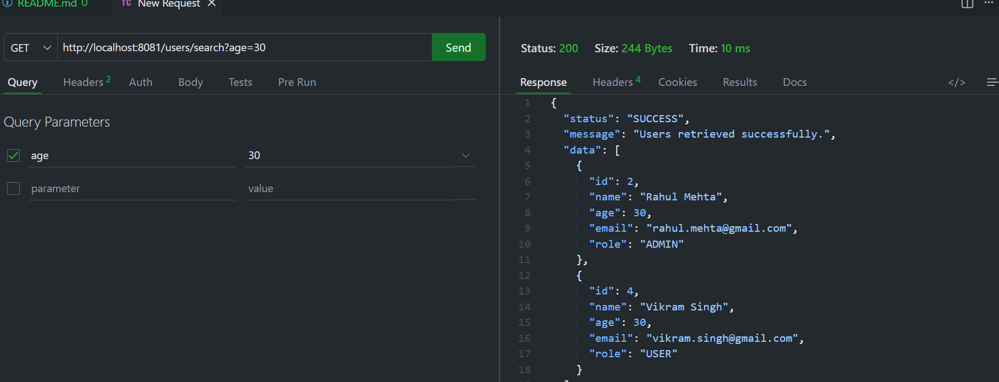
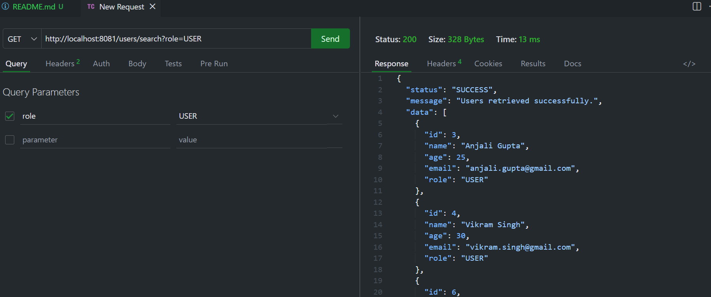
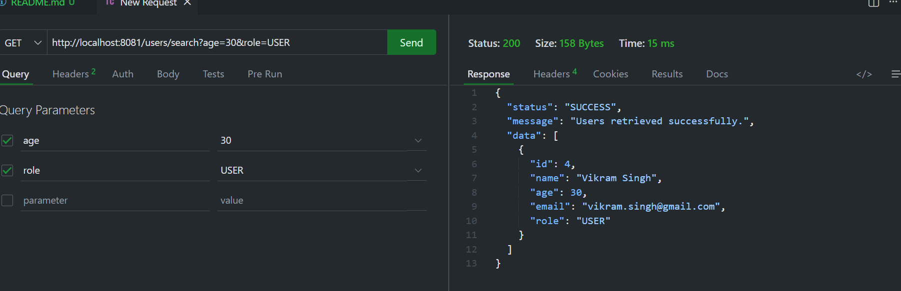
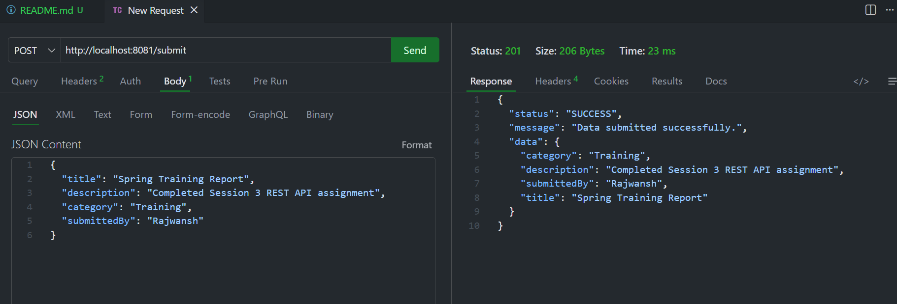
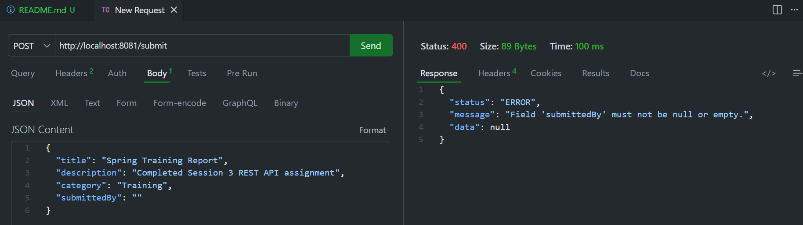
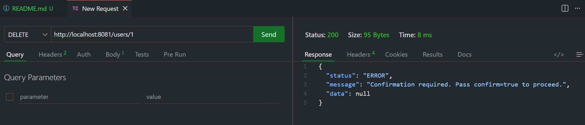
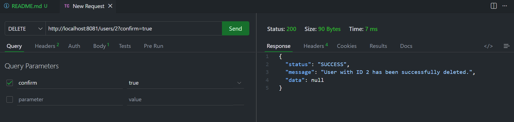
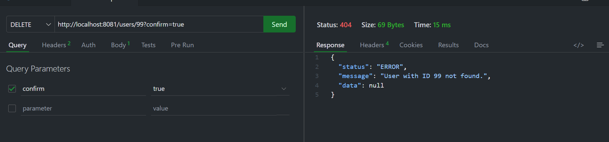

 ## Spring REST API — Session 3 Assignment

 A Spring Boot REST API demonstrating IoC, Dependency Injection, layered architecture, and RESTful endpoints using in-memory data.

## Overview

This project is a Spring Boot REST API built as part of Java Training Session 3. It demonstrates core Spring Framework concepts including Inversion of Control (IoC), constructor-based Dependency Injection, Component Scanning, and proper layered architecture.
The application manages a list of 7 in-memory users and exposes three REST APIs:

Search/filter users by name, age, email or role
Submit structured JSON data with validation
Delete a user only after explicit confirmation

## Tech Stack

- Java 17
- Spring Boot
- Maven
- REST APIs

## Architecture

🔹 Layers Overview

**Controller Layer**
- Handles incoming HTTP requests
- Maps endpoints using annotations like @RestController
- Delegates business logic to Service layer

**Service Layer**
- Contains core business logic
- Performs filtering, validation, and processing
- Acts as a bridge between Controller and Repository

**Repository Layer**
- Manages data storage
- Uses in-memory list to store dummy user data
- No database integration

**Model Layer**
- Represents data structure (User class)
-Used across the application

**DTO Layer**
- Used for data transfer (Request/Response objects)
- Helps in validation and clean API design

**Exception Layer**
- Handles global exceptions
- Ensures proper error responses

## How to Run

- Clone the repository
- Open the project in IntelliJ IDEA or VS Code
- Make sure Java 17 is installed
- Run the main Spring Boot application
- The server will start on: http://localhost:8080
- Use Postman or Thunder Client to test APIs

## Testing API

**GET All Users:**

**Filter by Name:**

**Filter by Age:**

**Filter by Role:**

**Multiple Filters:**

**POST /submit**

**POST With Validation**

**Delete User with Confirmation**

**Delete Success**

**DELETE Not Found (404)**

## Author

**Rajwansh Bhati**