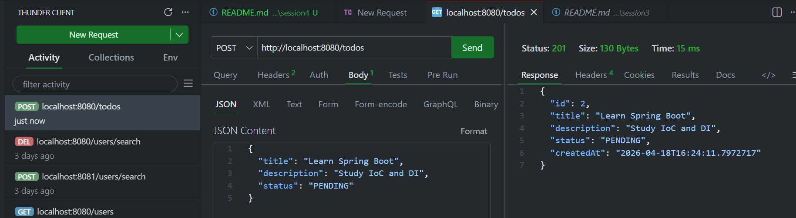
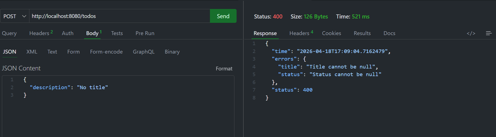
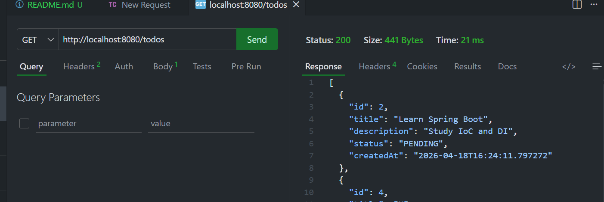
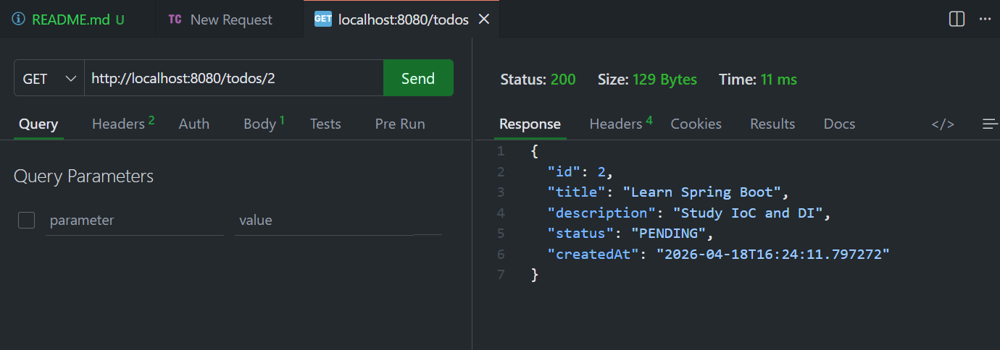
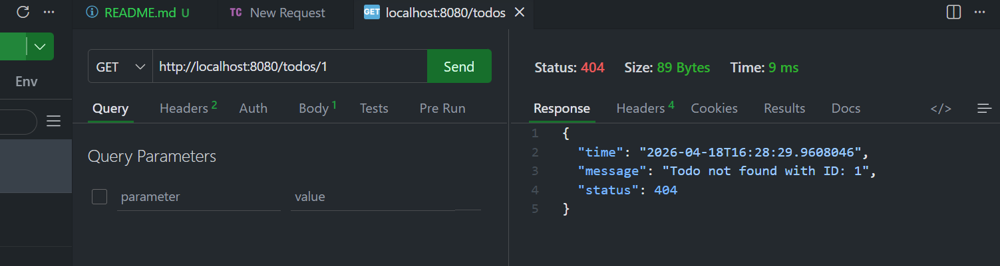
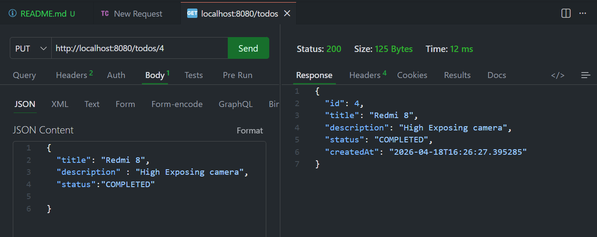
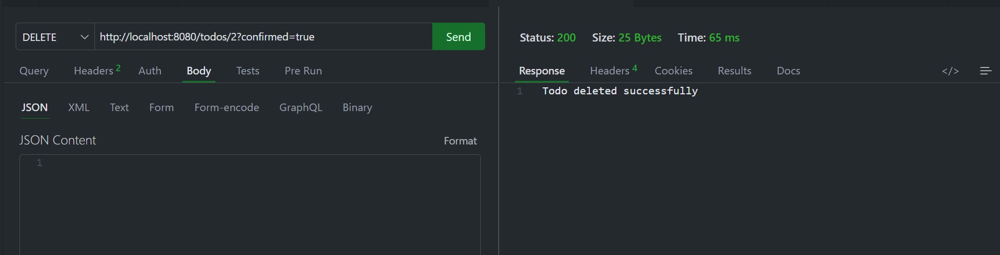
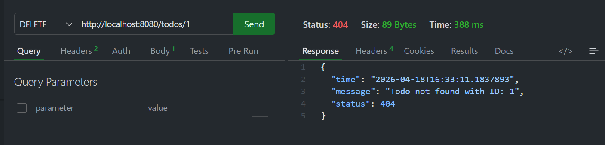
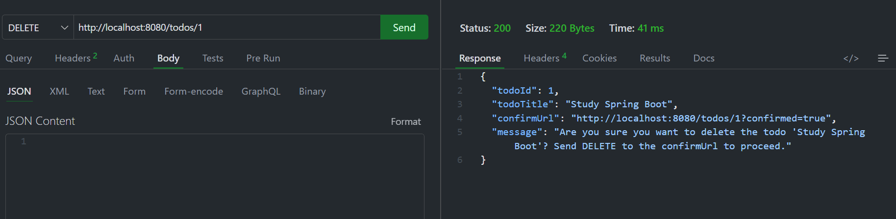

## TODO Application (Spring Boot)

A clean and structured Spring Boot REST API for managing TODO tasks.
This project demonstrates layered architecture, DTO usage, validation, JPA (Hibernate), and clean coding practices.

## Features

- Create TODO
- Get all TODOs
- Get TODO by ID
- Update TODO
- Delete TODO
- Status transition validation (PENDING ↔ COMPLETED)
- Input validation using @Valid
- Exception handling

## Tech Stack

- Java 17+
- Spring Boot
- Spring Web
- Spring Data JPA (Hibernate)
- Jakarta Validation

## Architecture

🔹 Layers Overview

**Controller Layer**
- Handles incoming HTTP requests
- Maps endpoints using annotations like @RestController
- Delegates business logic to Service layer

**Service Layer**
- Contains core business logic
- Performs filtering, validation, and processing
- Acts as a bridge between Controller and Repository

**Repository Layer**
- Manages data storage
- Uses in-memory list to store dummy user data
- No database integration

**Model Layer**
- Represents data structure (User class)
-Used across the application

**DTO Layer**
- Used for data transfer (Request/Response objects)
- Helps in validation and clean API design

**Exception Layer**
- Handles global exceptions
- Ensures proper error responses

## Setup & Run    

1. Clone the repository
git clone https://github.com/RajwanshBhati/dev-practice-repo.git
cd Rajwansh_java_training/session4/
2. Run the application
mvn spring-boot:run

## Testing API

1. CREATE TODO (POST)

**Validation in Create Todos**

2. GET ALL TODOS

3. GET TODO BY ID

**Validation in GET TODO BY ID**

4. UPDATE TODO

5. DELETE TODO

**Validation Delete**

**Confirm Delete**

## Author

**Rajwansh Bhati**
